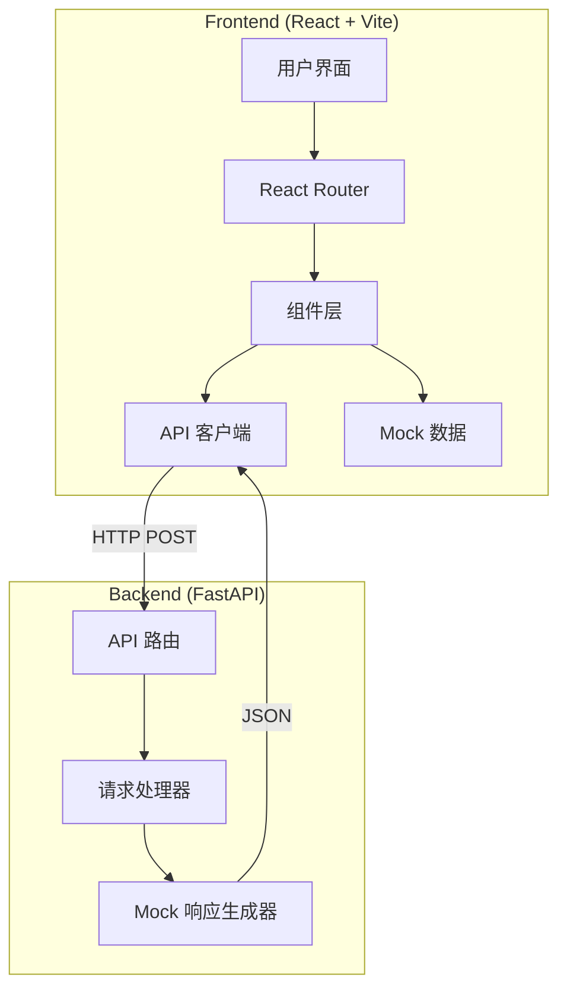

# 设计文档

## 概述

SGMastery MVP 是一个前后端分离的全栈学习应用，采用 React 前端和 FastAPI 后端架构。应用专注于提供三个核心学习模块的基础功能实现，使用 mock 数据和固定响应来验证前后端通信流程。本设计强调简洁性、可维护性和快速 MVP 交付。

### 设计目标

- 实现清晰的前后端分离架构
- 提供符合 UI 设计稿的视觉体验
- 建立可扩展的组件化结构
- 验证前后端 API 通信流程
- 使用 mock 数据快速实现 MVP

## 架构

### 系统架构



### 技术栈选择

**前端**:
- **React 18**: 现代化的组件化 UI 框架
- **Vite**: 快速的开发服务器和构建工具
- **Tailwind CSS**: 实用优先的 CSS 框架，便于实现设计稿
- **lucide-react**: 轻量级图标库
- **React Router**: 客户端路由管理

**后端**:
- **FastAPI**: 现代、快速的 Python Web 框架
- **Uvicorn**: ASGI 服务器
- **Pydantic**: 数据验证和序列化

**开发工具**:
- **TypeScript** (可选): 类型安全
- **ESLint + Prettier**: 代码规范
- **Python Black**: Python 代码格式化

### 目录结构

```
sgmastery-mvp/
├── frontend/
│   ├── src/
│   │   ├── components/
│   │   │   ├── layout/
│   │   │   │   ├── NavigationBar.tsx
│   │   │   │   └── Layout.tsx
│   │   │   ├── common/
│   │   │   │   ├── CodeEditor.tsx
│   │   │   │   ├── Button.tsx
│   │   │   │   └── Card.tsx
│   │   │   └── pages/
│   │   │       ├── KnowledgeHub.tsx
│   │   │       ├── CodeDebug.tsx
│   │   │       └── HCMPractice.tsx
│   │   ├── services/
│   │   │   └── api.ts
│   │   ├── data/
│   │   │   └── mockData.ts
│   │   ├── types/
│   │   │   └── index.ts
│   │   ├── App.tsx
│   │   └── main.tsx
│   ├── package.json
│   ├── vite.config.ts
│   ├── tailwind.config.js
│   └── index.html
│
└── backend/
    ├── app/
    │   ├── main.py
    │   ├── api/
    │   │   └── routes.py
    │   ├── models/
    │   │   └── schemas.py
    │   └── services/
    │       └── code_executor.py
    ├── requirements.txt
    └── README.md
```

## 组件和接口

### 前端组件设计

#### 1. Layout 组件

**NavigationBar.tsx**
```typescript
interface NavTab {
  id: string;
  label: string;
  icon: LucideIcon;
  path: string;
}

interface NavigationBarProps {
  activeTab: string;
  onTabChange: (tabId: string) => void;
}

// 功能：
// - 渲染三个导航 Tab
// - 应用毛玻璃效果样式
// - 高亮当前激活的 Tab
// - 处理 Tab 点击事件
```

**Layout.tsx**
```typescript
interface LayoutProps {
  children: React.ReactNode;
}

// 功能：
// - 提供全局布局容器
// - 包含 NavigationBar
// - 管理深色主题背景
```

#### 2. 通用组件

**CodeEditor.tsx**
```typescript
interface CodeEditorProps {
  value: string;
  onChange: (value: string) => void;
  language?: 'python' | 'sql';
  placeholder?: string;
  filename?: string;
}

// 功能：
// - 提供代码输入区域（使用 textarea 或轻量级编辑器）
// - 支持深色主题
// - 显示文件名标识
// - 使用等宽字体
// - 可选：显示行号
```

**Button.tsx**
```typescript
interface ButtonProps {
  children: React.ReactNode;
  onClick: () => void;
  variant?: 'primary' | 'secondary' | 'gradient';
  loading?: boolean;
  disabled?: boolean;
}

// 功能：
// - 提供可复用的按钮组件
// - 支持多种样式变体（蓝色、紫色渐变）
// - 支持加载状态
```

**Card.tsx**
```typescript
interface CardProps {
  title: string;
  tags?: string[];
  children: React.ReactNode;
  onExpand?: () => void;
}

// 功能：
// - 提供卡片容器组件
// - 圆角和半透明背景
// - 支持标签显示
// - 可选的展开按钮
```

#### 3. 页面组件

**KnowledgeHub.tsx**
```typescript
interface KnowledgeCard {
  id: string;
  title: string;
  tags: string[];
  content: string;
}

// 功能：
// - 显示"今日精进推送"标题
// - 渲染学习卡片列表
// - 使用 mockData 中的知识卡片数据
// - 处理"展开阅读"交互
```

**CodeDebug.tsx**
```typescript
interface DebugChallenge {
  level: number;
  totalLevels: number;
  code: string;
  hint: string;
}

// 功能：
// - 显示关卡进度
// - 渲染 CodeEditor 组件
// - 显示提示信息
// - 处理代码运行请求
// - 显示执行结果
```

**HCMPractice.tsx**
```typescript
interface Employee {
  id: string;
  name: string;
  position: string;
  effectiveDate: string;
  expirationDate: string;
}

interface HCMScenario {
  description: string;
  employees: Employee[];
  initialCode: string;
}

// 功能：
// - 显示业务背景描述
// - 渲染员工数据表格
// - 渲染 SQL CodeEditor
// - 处理"运行并检验"请求
// - 显示执行结果
```

### 前端服务层

**api.ts**
```typescript
interface CodeExecutionRequest {
  code: string;
  language?: string;
}

interface CodeExecutionResponse {
  status: string;
  message: string;
}

class ApiService {
  private baseURL: string;

  constructor(baseURL: string = 'http://localhost:8000') {
    this.baseURL = baseURL;
  }

  async executeCode(request: CodeExecutionRequest): Promise<CodeExecutionResponse> {
    // 发送 POST 请求到 /api/run-code
    // 处理响应和错误
    // 返回解析后的 JSON 数据
  }
}

export const apiService = new ApiService();
```

### Mock 数据结构

**mockData.ts**
```typescript
// Mock 用户数据
export const mockUser = {
  id: 'user_001',
  name: '学习者',
  avatar: '/avatar.png'
};

// 知识卡片数据
export const knowledgeCards: KnowledgeCard[] = [
  {
    id: 'k1',
    title: '秒懂前后端通信',
    tags: ['前后端', '基础'],
    content: '...'
  },
  {
    id: 'k2',
    title: 'CPU vs GPU：谁更强？',
    tags: ['硬件', '性能'],
    content: '...'
  },
  {
    id: 'k3',
    title: '数据库索引的秘密',
    tags: ['数据库', '优化'],
    content: '...'
  }
];

// 代码扫雷关卡数据
export const debugChallenges: DebugChallenge[] = [
  {
    level: 3,
    totalLevels: 10,
    code: `def calculate_salary(base, bonus):\n    return base + bonus\n\n# 数据中存在 NaN`,
    hint: '当前数据中存在空值（NaN），需要处理'
  }
];

// HCM 实战场景数据
export const hcmScenarios: HCMScenario[] = [
  {
    description: '找出生效日期冲突的人员',
    employees: [
      { id: 'E001', name: '张三', position: '工程师', effectiveDate: '2023-01-01', expirationDate: '2023-12-31' },
      { id: 'E001', name: '张三', position: '高级工程师', effectiveDate: '2023-06-01', expirationDate: '2024-06-01' },
      // ... 更多数据
    ],
    initialCode: '-- 编写 SQL 查询\nSELECT * FROM employees;'
  }
];
```

### 后端 API 设计

#### API 端点

**POST /api/run-code**

请求体:
```json
{
  "code": "string",
  "language": "python | sql (可选)"
}
```

响应体:
```json
{
  "status": "success",
  "message": "代码执行成功，发现 3 条重叠数据"
}
```

#### 后端代码结构

**schemas.py**
```python
from pydantic import BaseModel

class CodeExecutionRequest(BaseModel):
    code: str
    language: str | None = None

class CodeExecutionResponse(BaseModel):
    status: str
    message: str
```

**routes.py**
```python
from fastapi import APIRouter
from app.models.schemas import CodeExecutionRequest, CodeExecutionResponse
from app.services.code_executor import execute_code_mock

router = APIRouter()

@router.post("/api/run-code", response_model=CodeExecutionResponse)
async def run_code(request: CodeExecutionRequest):
    # 调用 mock 执行服务
    result = execute_code_mock(request.code)
    return result
```

**code_executor.py**
```python
from app.models.schemas import CodeExecutionResponse

def execute_code_mock(code: str) -> CodeExecutionResponse:
    """
    Mock 代码执行函数
    返回固定的成功响应
    """
    return CodeExecutionResponse(
        status="success",
        message="代码执行成功，发现 3 条重叠数据"
    )
```

**main.py**
```python
from fastapi import FastAPI
from fastapi.middleware.cors import CORSMiddleware
from app.api.routes import router

app = FastAPI(title="SGMastery API")

# 配置 CORS
app.add_middleware(
    CORSMiddleware,
    allow_origins=["http://localhost:5173"],  # Vite 默认端口
    allow_credentials=True,
    allow_methods=["*"],
    allow_headers=["*"],
)

app.include_router(router)

@app.get("/")
async def root():
    return {"message": "SGMastery API is running"}
```

## 数据模型

### 前端数据模型

```typescript
// 用户模型
interface User {
  id: string;
  name: string;
  avatar: string;
}

// 知识卡片模型
interface KnowledgeCard {
  id: string;
  title: string;
  tags: string[];
  content: string;
}

// 代码挑战模型
interface DebugChallenge {
  level: number;
  totalLevels: number;
  code: string;
  hint: string;
}

// 员工模型
interface Employee {
  id: string;
  name: string;
  position: string;
  effectiveDate: string;
  expirationDate: string;
}

// HCM 场景模型
interface HCMScenario {
  description: string;
  employees: Employee[];
  initialCode: string;
}

// API 请求/响应模型
interface CodeExecutionRequest {
  code: string;
  language?: string;
}

interface CodeExecutionResponse {
  status: string;
  message: string;
}
```

### 后端数据模型

```python
# Pydantic 模型用于请求验证和响应序列化

class CodeExecutionRequest(BaseModel):
    """代码执行请求模型"""
    code: str
    language: str | None = None

class CodeExecutionResponse(BaseModel):
    """代码执行响应模型"""
    status: str
    message: str
```

## 正确性属性

*属性是一个特征或行为，应该在系统的所有有效执行中保持为真——本质上是关于系统应该做什么的形式化陈述。属性作为人类可读规范和机器可验证正确性保证之间的桥梁。*


### 属性 1: 导航栏 Tab 切换视图

*对于任何* 导航栏 Tab（知识补给站、代码扫雷、HCM 实战），当用户点击该 Tab 时，应用应该切换到对应的页面视图

**验证需求: 3.4**

### 属性 2: 导航栏高亮当前激活 Tab

*对于任何* 当前激活的 Tab，导航栏应该为该 Tab 应用高亮样式，使其在视觉上区别于其他 Tab

**验证需求: 3.5**

### 属性 3: 导航栏 Tab 显示图标

*对于任何* 导航栏中的 Tab，该 Tab 应该显示对应的图标元素

**验证需求: 3.7**

### 属性 4: 学习卡片包含必需元素

*对于任何* 知识补给站页面中显示的学习卡片，该卡片应该包含标题、标签列表和"展开阅读"按钮

**验证需求: 4.3, 4.7**

### 属性 5: 代码编辑器保存输入状态

*对于任何* 输入到代码编辑器中的文本（包括多行文本），编辑器应该正确保存并显示该文本内容

**验证需求: 7.2, 7.6**

### 属性 6: 运行按钮触发完整 API 调用

*对于任何* 代码编辑器中的内容，当用户点击运行按钮时，前端应该读取编辑器内容，并通过 HTTP POST 请求将代码以 JSON 格式发送到 /api/run-code 端点

**验证需求: 8.1, 8.2, 8.3**

### 属性 7: 前端正确处理 API 响应

*对于任何* 后端返回的有效 JSON 响应，前端应该正确解析响应数据并在页面上显示执行结果

**验证需求: 8.4, 8.5**

### 属性 8: 前端显示 API 错误信息

*对于任何* 失败的 API 请求，前端应该捕获错误并在页面上显示错误提示信息

**验证需求: 8.6**

### 属性 9: 运行按钮显示加载状态

*对于任何* 代码执行请求，在请求进行期间，运行按钮应该显示加载状态（禁用或显示加载图标）

**验证需求: 8.7**

### 属性 10: API 验证请求格式

*对于任何* 发送到 /api/run-code 的请求，后端应该验证请求为 JSON 格式且包含 code 字段（字符串类型）

**验证需求: 9.2, 9.3**

### 属性 11: API 返回成功的 mock 响应

*对于任何* 有效的代码执行请求，后端应该返回 HTTP 200 状态码和固定的 mock JSON 响应

**验证需求: 9.4, 9.7**

### 属性 12: API 响应包含必需字段

*对于任何* API 返回的响应，响应 JSON 应该包含 status 字段和 message 字段

**验证需求: 9.5, 9.6**

### 属性 13: API 设置 CORS 头

*对于任何* API 响应，响应头应该包含正确的 CORS 配置以允许前端跨域请求

**验证需求: 9.8**

### 属性 14: 移动设备响应式布局

*对于任何* 移动设备视口尺寸（宽度 < 768px），前端应该调整布局以适应小屏幕显示

**验证需求: 11.2**

### 属性 15: 导航栏响应式可用性

*对于任何* 屏幕尺寸，导航栏应该保持可见和可交互状态

**验证需求: 11.3**

### 属性 16: 代码编辑器响应式可编辑性

*对于任何* 屏幕尺寸，代码编辑器应该保持可编辑状态并正确接受用户输入

**验证需求: 11.4**

### 属性 17: 数据表格响应式显示

*对于任何* 小屏幕尺寸（宽度 < 768px），数据表格应该支持横向滚动或进行响应式列调整以确保内容可访问

**验证需求: 11.5**

## 错误处理

### 前端错误处理

**API 请求错误**:
- 网络错误：显示"网络连接失败，请检查网络设置"
- 超时错误：显示"请求超时，请稍后重试"
- 服务器错误（5xx）：显示"服务器错误，请稍后重试"
- 客户端错误（4xx）：显示具体的错误信息

**用户输入错误**:
- 空代码提交：显示"请输入代码后再运行"
- 无效字符：由编辑器组件自动处理

**状态管理错误**:
- 使用 try-catch 包裹状态更新
- 提供错误边界组件捕获 React 组件错误
- 记录错误到控制台便于调试

### 后端错误处理

**请求验证错误**:
- 缺少 code 字段：返回 422 状态码和错误描述
- 无效的 JSON 格式：返回 400 状态码和错误描述
- 使用 Pydantic 自动验证请求体

**服务器错误**:
- 未捕获的异常：返回 500 状态码和通用错误信息
- 使用 FastAPI 的异常处理器统一处理错误
- 记录详细错误日志便于调试

**CORS 错误**:
- 确保 CORS 中间件正确配置
- 允许来自前端开发服务器的请求
- 在生产环境中限制允许的源

### 错误响应格式

```json
{
  "status": "error",
  "message": "错误描述信息",
  "code": "ERROR_CODE (可选)"
}
```

## 测试策略

### 双重测试方法

本项目采用单元测试和属性测试相结合的方法，以确保全面的代码覆盖和正确性验证。

**单元测试**:
- 用于验证特定示例、边缘情况和错误条件
- 测试具体的组件渲染和交互
- 验证 API 端点的特定响应
- 关注集成点和组件间交互

**属性测试**:
- 验证跨所有输入的通用属性
- 通过随机化实现全面的输入覆盖
- 每个属性测试最少运行 100 次迭代
- 每个测试必须引用设计文档中的属性

### 前端测试

**测试框架**:
- **Vitest**: 快速的单元测试框架（与 Vite 集成）
- **React Testing Library**: 组件测试
- **fast-check**: 属性测试库

**单元测试覆盖**:
- 组件渲染测试（NavigationBar、CodeEditor、Card 等）
- 用户交互测试（按钮点击、Tab 切换、文本输入）
- API 客户端测试（使用 mock fetch）
- 路由导航测试
- 错误边界测试

**属性测试示例**:

```typescript
// 属性 5: 代码编辑器保存输入状态
// Feature: sgmastery-mvp, Property 5: 对于任何输入到代码编辑器中的文本，编辑器应该正确保存并显示该文本内容
test('Property 5: Code editor preserves input state', () => {
  fc.assert(
    fc.property(fc.string(), (inputText) => {
      const { getByRole } = render(<CodeEditor value="" onChange={() => {}} />);
      const editor = getByRole('textbox');
      
      fireEvent.change(editor, { target: { value: inputText } });
      
      expect(editor.value).toBe(inputText);
    }),
    { numRuns: 100 }
  );
});

// 属性 6: 运行按钮触发完整 API 调用
// Feature: sgmastery-mvp, Property 6: 对于任何代码编辑器中的内容，点击运行按钮应该触发正确的 API 调用
test('Property 6: Run button triggers complete API call', () => {
  fc.assert(
    fc.property(fc.string(), async (code) => {
      const mockFetch = jest.fn().mockResolvedValue({
        ok: true,
        json: async () => ({ status: 'success', message: 'Mock response' })
      });
      global.fetch = mockFetch;
      
      const { getByRole } = render(<CodeDebug />);
      const editor = getByRole('textbox');
      const runButton = getByRole('button', { name: /运行/i });
      
      fireEvent.change(editor, { target: { value: code } });
      fireEvent.click(runButton);
      
      await waitFor(() => {
        expect(mockFetch).toHaveBeenCalledWith(
          'http://localhost:8000/api/run-code',
          expect.objectContaining({
            method: 'POST',
            headers: { 'Content-Type': 'application/json' },
            body: JSON.stringify({ code })
          })
        );
      });
    }),
    { numRuns: 100 }
  );
});
```

### 后端测试

**测试框架**:
- **pytest**: Python 测试框架
- **httpx**: 异步 HTTP 客户端（用于测试 FastAPI）
- **Hypothesis**: Python 属性测试库

**单元测试覆盖**:
- API 端点测试（/api/run-code）
- 请求验证测试
- 响应格式测试
- CORS 配置测试
- 错误处理测试

**属性测试示例**:

```python
# 属性 10: API 验证请求格式
# Feature: sgmastery-mvp, Property 10: 对于任何发送到 /api/run-code 的请求，后端应该验证请求格式
@given(st.text())
def test_property_10_api_validates_request_format(code: str):
    """Property 10: API validates request format for any code input"""
    from fastapi.testclient import TestClient
    from app.main import app
    
    client = TestClient(app)
    response = client.post(
        "/api/run-code",
        json={"code": code}
    )
    
    # 应该接受任何包含 code 字段的有效请求
    assert response.status_code in [200, 422]  # 200 成功或 422 验证失败
    if response.status_code == 200:
        data = response.json()
        assert "status" in data
        assert "message" in data

# 属性 11: API 返回成功的 mock 响应
# Feature: sgmastery-mvp, Property 11: 对于任何有效的代码执行请求，后端应该返回成功响应
@given(st.text(min_size=1))
def test_property_11_api_returns_success_response(code: str):
    """Property 11: API returns successful mock response for any valid code"""
    from fastapi.testclient import TestClient
    from app.main import app
    
    client = TestClient(app)
    response = client.post(
        "/api/run-code",
        json={"code": code}
    )
    
    assert response.status_code == 200
    data = response.json()
    assert data["status"] == "success"
    assert isinstance(data["message"], str)
    assert len(data["message"]) > 0

# 属性 13: API 设置 CORS 头
# Feature: sgmastery-mvp, Property 13: 对于任何 API 响应，应该包含正确的 CORS 头
@given(st.text())
def test_property_13_api_sets_cors_headers(code: str):
    """Property 13: API sets CORS headers for any request"""
    from fastapi.testclient import TestClient
    from app.main import app
    
    client = TestClient(app)
    response = client.post(
        "/api/run-code",
        json={"code": code},
        headers={"Origin": "http://localhost:5173"}
    )
    
    assert "access-control-allow-origin" in response.headers
```

### 集成测试

**端到端流程测试**:
- 前端发送代码 → 后端接收 → 返回响应 → 前端显示结果
- 使用真实的 HTTP 请求（不使用 mock）
- 验证完整的数据流

**测试环境**:
- 使用 Docker Compose 启动前后端服务
- 或使用测试脚本同时启动两个服务
- 确保端口配置正确

### 测试配置

**前端测试配置** (vitest.config.ts):
```typescript
import { defineConfig } from 'vitest/config';
import react from '@vitejs/plugin-react';

export default defineConfig({
  plugins: [react()],
  test: {
    globals: true,
    environment: 'jsdom',
    setupFiles: './src/test/setup.ts',
  },
});
```

**后端测试配置** (pytest.ini):
```ini
[pytest]
testpaths = tests
python_files = test_*.py
python_classes = Test*
python_functions = test_*
addopts = -v --tb=short
```

### 持续集成

**CI 流程**:
1. 安装依赖（前端和后端）
2. 运行代码检查（ESLint, Black）
3. 运行单元测试
4. 运行属性测试（最少 100 次迭代）
5. 生成测试覆盖率报告
6. 运行集成测试

**测试覆盖率目标**:
- 单元测试覆盖率：> 80%
- 属性测试：覆盖所有设计文档中的属性
- 关键路径：100% 覆盖（API 调用、数据处理）

## 实现注意事项

### 前端实现

**状态管理**:
- 使用 React useState 和 useContext 管理本地状态
- 不需要复杂的状态管理库（Redux/Zustand）
- Mock 用户数据存储在全局 context 中

**路由配置**:
- 使用 React Router v6
- 三个主要路由：/knowledge, /debug, /practice
- 默认路由重定向到 /knowledge

**样式实现**:
- 使用 Tailwind CSS 实用类
- 自定义毛玻璃效果类：`backdrop-blur-lg bg-opacity-80`
- 深色主题配置在 tailwind.config.js 中
- 渐变按钮：`bg-gradient-to-r from-blue-500 to-purple-600`

**代码编辑器选择**:
- 推荐使用原生 `<textarea>` 配合自定义样式
- 或使用轻量级库如 `react-simple-code-editor`
- 避免使用重量级编辑器（Monaco, CodeMirror）以保持 MVP 简洁

### 后端实现

**API 结构**:
- 使用 FastAPI 的 APIRouter 组织路由
- 使用 Pydantic 模型进行请求/响应验证
- 保持代码简洁，避免过度抽象

**CORS 配置**:
- 开发环境允许 localhost:5173
- 生产环境需要配置实际的前端域名
- 使用 FastAPI 的 CORSMiddleware

**Mock 响应**:
- 当前版本返回固定响应
- 未来可以扩展为根据代码内容返回不同响应
- 保留扩展接口便于后续实现真实代码执行

### 部署考虑

**开发环境**:
- 前端：`npm run dev` (Vite 开发服务器)
- 后端：`uvicorn app.main:app --reload`
- 两个服务独立运行

**生产环境** (未来):
- 前端：构建静态文件 (`npm run build`)
- 后端：使用 Gunicorn + Uvicorn workers
- 使用 Nginx 作为反向代理
- 或部署到云平台（Vercel, Railway, AWS）

### 性能优化

**前端优化**:
- 使用 React.memo 优化组件重渲染
- 代码分割（React.lazy）按路由加载
- 图片优化和懒加载
- Tailwind CSS 生产构建自动清除未使用的样式

**后端优化**:
- FastAPI 自动提供异步支持
- 使用 Uvicorn 的多 worker 模式
- 添加响应缓存（未来）
- API 请求限流（未来）

### 安全考虑

**当前 MVP**:
- 无需认证授权（本地单机使用）
- 不执行真实代码，只返回 mock 响应
- CORS 配置限制允许的源

**未来扩展**:
- 如果实现真实代码执行，需要沙箱环境
- 添加输入验证和清理
- 实现请求限流防止滥用
- 添加用户认证和会话管理

## 总结

本设计文档为 SGMastery MVP 提供了清晰的技术架构和实现指南。设计强调：

1. **简洁性**: 使用 mock 数据和固定响应快速验证前后端通信
2. **可扩展性**: 组件化设计便于未来功能扩展
3. **可测试性**: 明确的正确性属性和测试策略
4. **用户体验**: 符合 UI 设计稿的深色主题和现代界面

下一步将创建详细的实现任务列表，指导开发过程。
